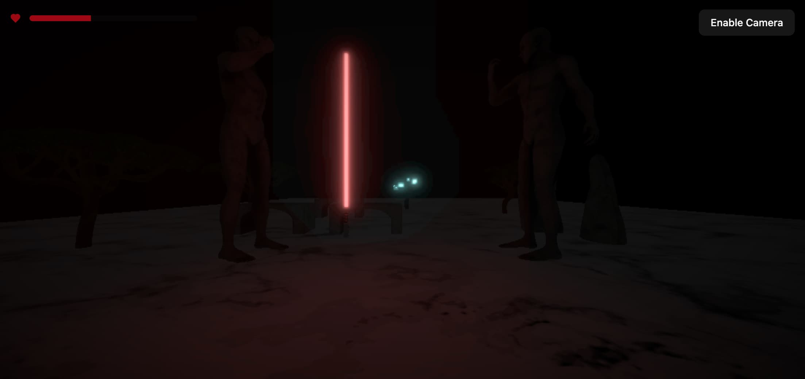

<h1 align='center'>
 saber</h1>

An interactive lightsaber simulator built with three.js

<a href="https://saber.fleet.im/">Visit Demo</a> · <a href="https://github.com/DipokalLab/saber/issues">Report Bugs</a>

## About The Project

This is a web 3D lightsaber simulator built with three.js, with a strong focus on performance and design. Reflect incoming blaster bolts with your lightsaber and feel like a true Jedi or Sith!

## Roadmap

- [x] Basic Saber
- [ ] More blade color
- [ ] Show left time
- [ ] Add hardware control

## Demo

https://github.com/user-attachments/assets/d9c3c652-467b-44d5-8b1f-2807093aab70

## Contributors

Hyeong Jun Huh [(GitHub)](https://github.com/DipokalLab)

## License

MIT License
